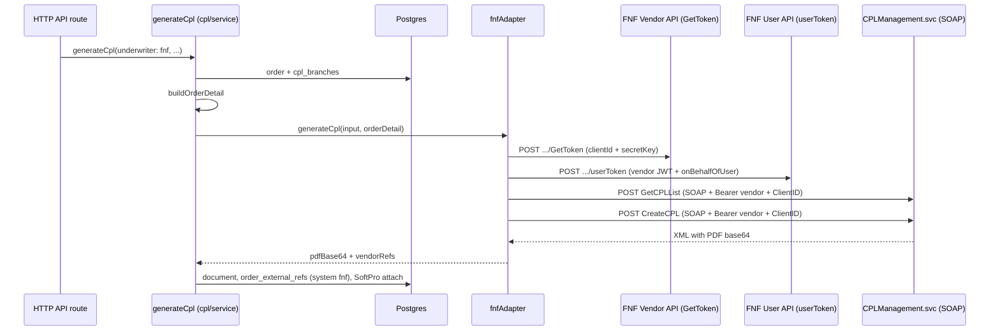

# FNF / Commonwealth CPL generation — full reference (TD Hub)

In TD Hub, **Commonwealth (Land Title / FNF stack) CPL** is implemented as underwriter **`fnf`**. The UI label is often **“FNF / Commonwealth”**; the API enum value is always **`fnf`**.

This document describes **how this app generates CPLs through FNF’s REST + SOAP CPL API** — not Westcor’s JSON `VendorApi` (see **`CPL_WESTCOR_GENERATION.md`**).

**This repo:** `td-hub` (`src/lib/integrations/cpl/fnf`).  
**Canonical copy:** `TransactionDeskClone/docs/CPL_FNF_COMMONWEALTH_GENERATION.md` (keep in sync).

---

## 1. High-level flow



**Differences from Westcor (at a glance):**

| Aspect | Westcor | FNF / Commonwealth |
|--------|---------|---------------------|
| Transport | JSON REST (`VendorApi/Order/Update`) | **SOAP 1.1** to `CPLManagement.svc` |
| Auth | Single OAuth2 password bearer | **Two JWTs**: vendor JWT + **user** JWT (`onBehalfOfUser`) |
| Property in payload | `property.address1` | **`PropertyAddress`** (and city/state/zip/county) inside SOAP |
| Branch list | From token `groups` / DB metadata | **Static mock branches** in code when `getBranches` runs (see §10) |

---

## 2. How a request enters the system

Same orchestration as other underwriters: **`generateCpl`** in `src/lib/domain/cpl/service.ts`.

Required input:

| Field | For Commonwealth path |
|-------|------------------------|
| `underwriter` | **`'fnf'`** |
| `orderId` | Internal order id |
| `branchId` | Active row in **`cpl_branches`** (validated; not forwarded into SOAP in current code — same pattern as Westcor) |
| `cplMode` | Optional `'single'` \| `'multiple'` — **form name** heuristics |
| `lenderOverrides` | Optional — fills lender fields in **`CreateCPL`** SOAP |

### HTTP routes

| Route | Notes |
|-------|--------|
| `POST /api/vendor-actions/cpl` | `underwriter: "fnf"` |
| `POST /api/client/orders/[id]/cpl` | Same |
| `POST /api/orders/batch/cpl` | Same |

Zod allows `'westcor' \| 'fnf' \| 'natic' \| 'doma'`.

---

## 3. Domain layer (shared with all CPL underwriters)

Identical to Westcor for steps **before** the adapter:

1. Load order via **`getOrderById`**.
2. Load **`cpl_branches`** by `branchId` + `is_active`.
3. **`buildOrderDetail(order, lenderOverrides)`** → **`CplOrderDetail`** (`src/lib/integrations/cpl/types.ts`).

### `CplOrderDetail` fields used by FNF SOAP

| SOAP element | Source |
|--------------|--------|
| **GetCPLList** | |
| `PropertyState` | `property.state` or `'CA'` |
| `PropertyCounty` | `property.county` |
| **CreateCPL** | |
| `FileNumber` | `fileNumber` |
| `PropertyAddress` | `property.address` |
| `PropertyCity` | `property.city` |
| `PropertyState` | `property.state` or `'CA'` |
| `PropertyZip` | `property.zip` |
| `PropertyCounty` | `property.county` |
| `BuyerName` | All buyers joined with **`; `** |
| `SellerName` | All sellers joined with **`; `** |
| `LenderName` | `lender.name` |
| `LenderAddress` / `City` / `State` / `Zip` | From overrides or lender object |
| `PurchasePrice` | `salesPrice` string or `'0'` |
| `LoanAmount` | `loanAmount` string or `'0'` |
| `CPLFormID` | Selected form’s `id` from GetCPLList |

**Tokens in SOAP:** The **user JWT** is embedded as **`v3:Token`** in the envelope. The **vendor JWT** is sent as HTTP header **`Authorization: Bearer {vendorToken}`**. **`ClientID`** header = `FNF_CLIENT_ID`.

---

## 4. Configuration: `getConfig()` and mock mode

**File:** `src/lib/integrations/cpl/fnf/client.ts`

If **`FNF_VENDOR_URL`** is missing → **`getConfig()` returns `null`** → **`mockGenerateCpl`**: fake CPL id, `MOCK_PDF_BASE64`, ~90ms delay, **`vendor_api_logs`** with `mock: true`.

When present, config is:

| Config key | Env var |
|------------|---------|
| `vendorUrl` | `FNF_VENDOR_URL` (trailing `/` normalized) |
| `userUrl` | `FNF_USER_URL` + `/` |
| `cplUrl` | `FNF_CPL_URL` + `/` |
| `clientId` | `FNF_CLIENT_ID` |
| `secretKey` | `FNF_SECRET_KEY` |
| `onBehalfOfUser` | `FNF_ON_BEHALF_OF_USER` |

**Note:** `.env.example` may list **`FNF_USERNAME`** / **`FNF_PASSWORD`** — the current **`fnf/auth.ts`** implementation does **not** use them; vendor auth is **clientId + secretKey** only.

---

## 5. Authentication (two-tier JWT)

**File:** `src/lib/integrations/cpl/fnf/auth.ts`  
**Vendor constant:** `vendor_tokens.vendor = 'fnf'`.

### 5.1 Vendor token (`vendor_jwt`)

1. If **`vendor_tokens`** has an unexpired row with `token_type = 'vendor_jwt'`, return it.
2. Else **`POST {vendorUrl}api/FnfAuthIdentityProvider/GetToken`**
   - `Content-Type: application/json`
   - Body: `{ "clientId", "secretKey" }`
3. Parse JSON: `jwtToken` or `token`; `expiresIn` seconds (default **3500** if absent).
4. Insert **`vendor_tokens`**: `token_type = 'vendor_jwt'`, `expiresAt = now + expiresIn * 1000` (no skew subtraction unlike Westcor).
5. Log **`vendor_api_logs`**: `operation: get_vendor_token`, `vendor: fnf`.

**Timeout:** 20 seconds.

### 5.2 User token (`user_jwt`)

1. If unexpired **`user_jwt`** in **`vendor_tokens`**, return it.
2. Else **`POST {userUrl}userToken`** (URL is literally `userToken` path segment on `FNF_USER_URL` base).
   - Body: `{ "accessToken": <vendor JWT>, "onBehalfOfUser": <email or id per FNF> }`
3. Parse: `user_token` or `userToken` or `token`; `expiresIn` (default 3500).
4. Store as **`user_jwt`** in **`vendor_tokens`**.
5. Log **`get_user_token`**.

**Timeout:** 20 seconds.

**Operational note:** Vendor and user tokens are cached **independently**. If you rotate vendor credentials or change `onBehalfOfUser`, stale **`user_jwt`** rows can cause confusing failures until expiry or manual delete from **`vendor_tokens`**.

---

## 6. SOAP: `GetCPLList`

**File:** `src/lib/integrations/cpl/fnf/soap.ts`  
**Function:** `getCplForms(cfg, vendorToken, userToken, orderDetail)`

**Endpoint:** `POST {cplUrl}v3/CPLManagement.svc`

**HTTP headers:**

| Header | Value |
|--------|--------|
| `Content-Type` | `text/xml; charset=utf-8` |
| `SOAPAction` | `GetCPLList` |
| `Authorization` | `Bearer {vendorToken}` |
| `ClientID` | `cfg.clientId` |

**Envelope:** `buildGetCplListEnvelope` — namespace `http://www.fnf.com/xes/cpl/v3`, operation **`GetCPLList`**:

- `Token` = **user JWT** (XML-escaped)
- `PropertyState`, `PropertyCounty` only (no street address in list call)

**Response parsing:** `xml2js` with `explicitArray: false`, `ignoreAttrs: true`. Body extracted from `s:Envelope` / `soap:Envelope` / `soapenv:Envelope` variants.

**Forms path:** `GetCPLListResponse` → `GetCPLListResult` → `CPLForms.CPLForm` (array or single).

Each form mapped to `{ id: CPLFormID \| FormID, name: CPLFormName \| FormName \| Description }`.

**Timeout:** 20 seconds.

---

## 7. Form selection (`selectCplForm`)

**File:** `fnf/client.ts` (local function, same idea as Westcor)

- **`single`:** Prefer name matching `/\bsingle\b/i` and not `/multiple|blanket/i`; else first non-multiple/blanket; else **`forms[0]`**.
- **`multiple`:** Prefer multiple/blanket in name; else **`forms[0]`**.

---

## 8. SOAP: `CreateCPL`

**Function:** `generateCplSoap(...)`

**Same endpoint:** `POST {cplUrl}v3/CPLManagement.svc`

**Headers:** Same as GetCPLList except **`SOAPAction: CreateCPL`**.

**Envelope:** `buildCreateCplEnvelope` — operation **`CreateCPL`** with:

- `Token` (user JWT)
- `CPLFormID`, `FileNumber`
- `PropertyAddress`, `PropertyCity`, `PropertyState`, `PropertyZip`, `PropertyCounty`
- `BuyerName`, `SellerName` (semicolon-separated lists)
- `LenderName`, `LenderAddress`, `LenderCity`, `LenderState`, `LenderZip`
- `PurchasePrice`, `LoanAmount` (strings)

All user-supplied strings pass through **`escapeXml`**.

**Timeout:** **30 seconds**.

**Response parsing:** `CreateCPLResponse.CreateCPLResult` **or** `GenerateCPLResponse.GenerateCPLResult` (compat alias).

PDF and ids from:

- `CPLLetters` → `a:CPLLetter` or `CPLLetter` (single or array; first element used)
- PDF: `a:Content` or `Content` (base64)
- `a:CPLLetterID` / `CPLLetterID` → `cplId`
- `a:CPLNumber` / `CPLNumber` → `cplNumber`

Throws if no result node or empty PDF content.

---

## 9. Adapter return value and `order_external_refs`

On success **`fnfAdapter`** returns:

```ts
{
  pdfBase64: pdf,
  cplId,
  vendorRefs: {
    fnf_cpl_id: cplId,
    fnf_cpl_number: cplNumber || `CPL-${Date.now()}`,
    fnf_form_id: form.id,
    fnf_form_name: form.name,
  },
}
```

**`generateCpl`** stores refs under **`order_external_refs.system = 'fnf'`** (enum **`vendor_system`**).

Document upload naming is the same as other underwriters: `{underwriter}_{fileNumber}_{n}.pdf` with `underwriter` = `fnf`.

---

## 10. `getBranches()` behavior (important)

**File:** `fnf/client.ts` → **`getBranches`**

- **No `FNF_VENDOR_URL`:** Returns **`MOCK_BRANCHES`** (Glendale / Burbank samples) after a short delay.
- **Even when config exists:** Still returns the **same hard-coded `MOCK_BRANCHES`** and logs `meta: { source: 'static' }`.

There is **no live FNF branch API call** in this adapter today. Admin/UI that lists Commonwealth branches for CPL may be showing **placeholder data** unless fed from **`cpl_branches`** seeded elsewhere.

---

## 11. Logging

| `vendor_api_logs.operation` | When |
|----------------------------|------|
| `get_vendor_token` | Auth (`fnf/auth.ts`) |
| `get_user_token` | Auth |
| `get_cpl_forms` | After successful GetCPLList parse (`meta.formCount`) |
| `generate_cpl` | Success (`formId`, `formName`, `cplId`, `cplNumber`) or failure (`CPL_ERROR`) |
| `get_branches` | Mock or static branches |

Failures in **`generateCpl`** service still write **`cpl_error_logs`** with `underwriter` matching input (stored as **`fnf`**).

---

## 12. Environment variables (summary)

| Variable | Purpose |
|----------|---------|
| `FNF_VENDOR_URL` | Base for `api/FnfAuthIdentityProvider/GetToken` |
| `FNF_USER_URL` | Base URL ending with path used for `.../userToken` |
| `FNF_CPL_URL` | Base for `v3/CPLManagement.svc` |
| `FNF_CLIENT_ID` | JSON body + `ClientID` header on SOAP |
| `FNF_SECRET_KEY` | Vendor GetToken body |
| `FNF_ON_BEHALF_OF_USER` | User token delegation target |

See **`docs/playbook/09-runbook.md`** and **`.env.example`**.

---

## 13. Source file index

| Topic | Path |
|--------|------|
| FNF adapter | `src/lib/integrations/cpl/fnf/client.ts` |
| Vendor + user JWT | `src/lib/integrations/cpl/fnf/auth.ts` |
| SOAP envelopes + HTTP | `src/lib/integrations/cpl/fnf/soap.ts` |
| Shared CPL types | `src/lib/integrations/cpl/types.ts` |
| Orchestration | `src/lib/domain/cpl/service.ts` |
| CPL API routes | `src/app/api/vendor-actions/cpl/route.ts`, `client/orders/[id]/cpl`, `orders/batch/cpl` |

---

## 14. Operator checklist (Commonwealth / FNF)

- [ ] **`FNF_VENDOR_URL`**, **`FNF_USER_URL`**, **`FNF_CPL_URL`**, **`FNF_CLIENT_ID`**, **`FNF_SECRET_KEY`**, **`FNF_ON_BEHALF_OF_USER`** set in the runtime environment.
- [ ] **`onBehalfOfUser`** matches an identity FNF recognizes for your agency (often an agency user email).
- [ ] Order **property** has **county** populated — required for **GetCPLList**; full address for **CreateCPL**.
- [ ] **Buyers/sellers** produce sensible **`BuyerName` / `SellerName`** strings (joined with `; `).
- [ ] **Lender** address: use **`lenderOverrides`** in API if DB lender party has no address.
- [ ] If auth behaves oddly after credential rotation, clear **`vendor_tokens`** rows for **`vendor = 'fnf'`** and retry.
- [ ] Remember API underwriter value is **`fnf`**, not `commonwealth`.

---

## 15. Related docs

- **`CPL_WESTCOR_GENERATION.md`** — Westcor JSON flow (different payloads and endpoints).
- **`CPL_CALL_FLOW_REFERENCE.md`** — Broader legacy + portal CPL narrative.
- **`HUB_ORDER_FLOW_AND_PAYLOAD_REFERENCE.md`** — SoftPro open order (separate from CPL).

---

*Document generated from `td-hub` source. Update when FNF changes WSDL paths, SOAP actions, or auth endpoints.*
