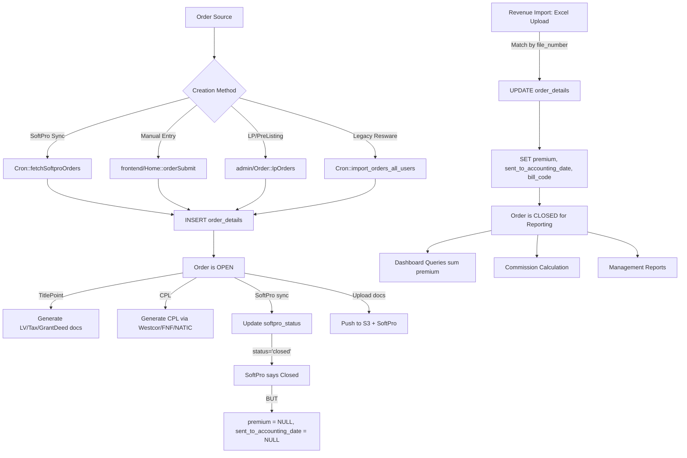
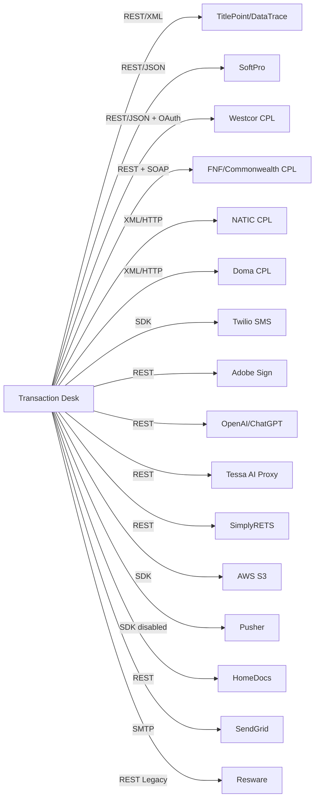

# Transaction Desk Full System Audit & Rebuild Blueprint

**Prepared:** March 3, 2026
**Branch:** production-softpro
**Purpose:** Forensic audit for rebuild readiness

---

## 1. Executive Summary

Transaction Desk is Pacific Coast Title Company's core order management platform built on PHP/CodeIgniter 2.x with HMVC (Wiredesignz Modular Extensions). It manages the full title & escrow order lifecycle: order creation, title searches, CPL generation, document management, revenue tracking, and sales/production reporting.

### Key Architectural Facts

- **Framework:** CodeIgniter 2.x + HMVC (2 modules: `admin`, `frontend`)
- **Database:** Single MySQL instance, 59+ tables, no foreign key constraints
- **Migrations:** 516 Phinx migrations (2020-2025), no database-level FK enforcement
- **External Integrations:** 15 vendor APIs (TitlePoint, SoftPro, Westcor, FNF, NATIC/Doma, Twilio, Adobe Sign, OpenAI, Tessa, SimplyRETS, AWS S3, Pusher, HomeDocs, SendGrid, Safewire)
- **Routes:** 400+ route definitions, 835-line routes.php
- **Cron Controller:** 9,200 lines, 100+ public methods, ALL exposed as unauthenticated HTTP endpoints
- **Core Library:** `Order.php` is ~4,000+ lines, the central "god class"

### Critical System-Wide Risks

1. **Revenue data is ONLY populated via manual Excel import** -- SoftPro sync does NOT set `premium` or `sent_to_accounting_date`
2. **Reporting inconsistencies** -- 6 different date/filter combinations across reports yield different numbers for the same data
3. **No authentication on 52 cron endpoints** -- any HTTP request can trigger data sync/import operations
4. **Hardcoded credentials in source** -- SendGrid password, API auth, encryption key, Resware passwords
5. **CSRF protection disabled**, no XSS filtering, no database-level constraints
6. **`pct_softpro_lookup_table` is a "god table"** -- stores sales reps, title officers, customers, lenders, agents, escrow contacts (6 model classes, one table)

---

## 2. Repo/Module Inventory

### Top-Level Structure

```
TransactionDeskClone/
├── application/           # CodeIgniter application
│   ├── config/            # CI config (routes, database, constants)
│   ├── core/              # MY_Model, MY_Router, MY_Loader (HMVC)
│   ├── helpers/            # common_helper, sendemail_helper, pma_helper, homedocsapi_helper
│   ├── hooks/             # DatabaseErrorHook only
│   ├── libraries/         # Shared + domain libraries
│   │   ├── order/         # 20 libraries (Order.php, SoftPro.php, Titlepoint.php, etc.)
│   │   ├── hr/            # HR templates
│   │   └── SetaPDF/       # PDF manipulation library
│   └── modules/
│       ├── admin/         # Admin panel (controllers, models, views)
│       │   ├── controllers/order/  # 17 controllers (Home, Order, Reports, Sales, etc.)
│       │   ├── controllers/hr/     # 20 controllers (HR admin)
│       │   ├── models/order/       # 30+ models
│       │   └── views/              # Admin views
│       └── frontend/      # Public & user-facing
│           ├── controllers/order/  # 17 controllers (Dashboard, SalesRep, Cron, etc.)
│           ├── controllers/hr/     # 11 controllers
│           ├── models/order/       # 18 models
│           └── views/              # Frontend views
├── cpl/                   # Standalone CPL web app (legacy, separate PHP)
├── db/migrations/         # 516 Phinx migration files
├── assets/                # CSS, JS, images (admin, backend, frontend)
├── uploads/               # File uploads directory
├── docs/                  # Existing documentation
└── system/                # CodeIgniter framework core
```

### Module Responsibilities

| Module | Scope | Key Controllers |
|--------|-------|-----------------|
| **admin/order** | Admin panel: order mgmt, reports, user admin, CPL branches, fees, agents | Home (80+ methods), Order, Reports, ManagementReports, Sales, Title, TitlePoint, Cpl, Fees, RulesManager |
| **frontend/order** | User-facing: dashboards, order creation, TitlePoint, document mgmt, cron | Dashboard, SalesRep, TitleOfficers, EscrowProduction, Common (~35 methods), Cron (100+ methods), Home, DashboardMail (~25 methods) |
| **admin/hr** | HR admin: user mgmt, time tracking, training, escrow instructions | 20 controllers for HR CRUD operations |
| **frontend/hr** | Employee-facing: time cards, vacation, memos, trainings | 11 controllers |
| **admin/calc** | Rate calculator admin | Title rates, resale/refinance rates, fees |
| **frontend/calc** | Public calculator | Quote generation |
| **frontend/api** | External API (1 controller) | PctCalculator (bearer token auth) |
| **frontend (static)** | Public website pages | Aboutus, Residential, Commercial, Contact, AgentResources |

### Library Inventory (application/libraries/order/)

| Library | Lines | Purpose |
|---------|-------|---------|
| `Order.php` | ~4000 | God class: order CRUD, S3 uploads, dashboard queries, notifications, revenue import |
| `SoftPro.php` | ~600 | SoftPro REST API client |
| `Titlepoint.php` | ~500 | TitlePoint (DataTrace) title plant searches |
| `Westcor.php` | ~600 | Westcor underwriter CPL generation |
| `Fnf.php` | ~600 | FNF/Commonwealth CPL generation (REST + SOAP) |
| `Natic.php` | ~400 | NATIC/Doma CPL generation (XML) |
| `Twilio.php` | ~50 | SMS via Twilio SDK |
| `Adobe.php` | ~80 | Adobe Sign eSignature |
| `ChatGPT.php` | ~200 | OpenAI doc classification with retry |
| `Tessa.php` | ~300 | AI prelim report analysis |
| `OcrService.php` | ~150 | Local OCR (Tesseract/Poppler) |
| `Rets.php` | ~100 | SimplyRETS MLS data (debug code present) |
| `Resware.php` | ~200 | Legacy Resware API (being replaced by SoftPro) |
| `Common.php` | ~3800 | Frontend shared operations: CPL, docs, prelim, surveys, fees |
| `Common_lib.php` | ~200 | Additional shared utilities |
| `SalesDashboardTemplate.php` | ~300 | Sales dashboard HTML template |
| `EscrowDashboardTemplate.php` | ~200 | Escrow dashboard HTML template |
| `AdminTemplate.php` | ~100 | Admin layout template |
| `Template.php` | ~100 | Frontend layout template |
| `Survey.php` | ~200 | Survey management |
| `PdfSplitter.php` | ~100 | PDF page splitting |
| `Parsedown.php` | ~800 | Markdown parser |

---

## 3. Order Lifecycle

### Lifecycle Diagram



### Order Status Values

| Status Field | Possible Values | Set By |
|-------------|----------------|--------|
| `softpro_status` | `open`, `closed`, `canceled`, `duplicate`, `inprocess`, `completed` | SoftPro API sync |
| `resware_status` | `open`, `closed` | Legacy Resware import |
| `status` | `1` (active) | Order creation |
| `is_softpro_order` | `0` or `1` | Order creation source |

### Source of Truth Fields

| Concept | Field | Table | Set By | Used By |
|---------|-------|-------|--------|---------|
| **Open status** | `softpro_status != 'closed' AND != 'canceled' AND != 'inprocess' AND != 'duplicate'` | `order_details` | SoftPro sync | Open order queries |
| **Closed status (reporting)** | `sent_to_accounting_date IS NOT NULL` | `order_details` | Revenue import ONLY | All revenue/closed reports |
| **Revenue/premium** | `premium` | `order_details` | Revenue import ONLY | Dashboard sums, commission |
| **Revenue recognition date** | `sent_to_accounting_date` (set from spreadsheet `transaction_date`) | `order_details` | Revenue import | Closed order date filter |
| **Sales rep** | `sales_representative` | `transaction_details` | SoftPro sync + Revenue import override | All rep-filtered reports |
| **Title officer** | `title_officer` | `transaction_details` | SoftPro sync | TO dashboard/reports |
| **Branch** | Derived from `file_number` prefix (GLT, OCT, ONT, PRV, TSG) | `order_details` | SoftPro file number | Branch-level reports |

### Critical Gap: The Revenue Import Wall

```
SoftPro marks order "closed" ──► softpro_status = 'closed'
                                  BUT premium = NULL
                                  AND sent_to_accounting_date = NULL
                                  ──► Order is INVISIBLE to all revenue reports

Excel Revenue Import run    ──► premium = $X,XXX
                                  sent_to_accounting_date = transaction_date
                                  ──► Order NOW appears in closed reports
```

**Impact:** There is a mandatory delay between operational close and reporting close. Any order not in the Excel import file is permanently invisible to revenue dashboards.

---

## 4. Data Model

### Core Tables & Relationships

```
order_details (central hub, ~45 columns)
├── property_id ──► property_details
├── transaction_id ──► transaction_details
├── customer_id ──► customer_basic_details / pct_softpro_lookup_table
├── escrow_officer_id ──► pct_softpro_lookup_table
└── Links via file_number to revenue data

property_details
├── id, full_address, city, state, zip, county, apn
├── westcor_property_id, lender_id, escrow_lender_id
└── assignment_clause, lender_company_id

transaction_details
├── id, transaction_type ('Refinance'|'Purchase')
├── sales_representative ──► pct_softpro_lookup_table.id
├── title_officer ──► pct_softpro_lookup_table.id
├── sales_amount, loan_amount
├── purchase_type ──► product type
└── order_type ──► pct_softpro_order_type.id

pct_softpro_lookup_table (GOD TABLE - 6 model classes)
├── id, full_name, first_name, last_name, officer_name
├── email, phone, password
├── is_sales_rep, is_title_officer, is_payoff_user
├── is_master, is_added_lender_by_cpl_proposed
├── status, branch, company_name
├── commission_draw_value, first_in_threshold, apply_bonus
└── soft_pro_code, title_production_lookup_code
```

### Key Reporting Fields in order_details

| Field | Type | Set By | Purpose |
|-------|------|--------|---------|
| `file_number` | varchar | SoftPro sync | Primary order identifier |
| `created_at` | datetime | Order creation | Open order date filter |
| `sent_to_accounting_date` | datetime | Revenue import only | Closed order date filter |
| `premium` | decimal | Revenue import only | Revenue amount |
| `escrow_amount` | decimal | Revenue import | Escrow fee amount |
| `bill_code` | varchar | Revenue import | TPC, TPW, ESC, TSGW, UPRE |
| `prod_type` | varchar | Revenue import / sync | Transaction type label |
| `profile` | varchar | Revenue import | Branch profile |
| `softpro_status` | varchar | SoftPro sync | Operational status |
| `is_softpro_order` | tinyint | Creation | Source flag |
| `resware_closed_status_date` | datetime | SoftPro sync (on first close) | Operational close date |
| `order_completed_date` | datetime | SoftPro sync | Completion date |
| `underwriter` | varchar | Manual/import | Underwriter name |
| `cpl_document_name` | varchar | CPL generation | CPL file reference |

### Integration-Specific Tables

| Table | Integration | Purpose |
|-------|------------|---------|
| `pct_order_title_point_data` | TitlePoint | LV/Tax/GrantDeed search status per order |
| `pct_title_point_document_records` | TitlePoint | Individual document records |
| `pct_order_westcore_token` | Westcor | OAuth token cache |
| `pct_order_westcore_branches` | Westcor | Branch/office data |
| `pct_order_fnf_token` / `_user_token` | FNF | JWT token cache |
| `pct_order_fnf_agents` | FNF | Agent/branch data |
| `pct_order_natic_branches` | NATIC | Branch data |
| `pct_order_doma_branches` | Doma | Branch data |
| `pct_order_api_logs` | All | Central API logging |
| `pct_order_cpl_api_logs` | CPL | CPL error logging |
| `pct_resware_log` | Resware/SoftPro | Legacy request/response log |
| `pct_order_documents` | Documents | Document records |
| `pct_order_notifications` | Notifications | User notification records |
| `pct_commission_range` | Commissions | Rate tiers |
| `pct_commission_bonus` | Commissions | Bonus config |
| `pct_underwriter_tiers` | Commissions | Underwriter-based tiers |
| `pct_user_monthly_commission` | Commissions | Calculated monthly values |
| `ci_sessions` | Sessions | Session storage |

---

## 5. Integrations

### Integration Map



### Per-Integration Summary

| Integration | Transport | Auth | Tables Written | Active? |
|-------------|-----------|------|----------------|---------|
| **TitlePoint** | REST+XML via cURL | Username/password in query params | `pct_order_title_point_data`, `pct_title_point_document_records` | Yes |
| **SoftPro** | REST/JSON via cURL | HMAC-SHA256 token | `order_details`, `transaction_details`, `pct_resware_log` | Yes (primary) |
| **Westcor** | REST/JSON via cURL | OAuth2 (Resource Owner) | `order_details` (westcor_*), `pct_order_westcore_*` | Yes |
| **FNF** | REST + SOAP | Two-tier JWT | `pct_order_fnf_*`, `order_details` | Yes |
| **NATIC** | XML/HTTP via cURL | Username/password in XML body | `pct_order_natic_branches` | Yes |
| **Doma** | XML/HTTP via cURL | Username/password in XML body | `pct_order_doma_branches` | Yes |
| **Twilio** | PHP SDK | SID/Token | None (in-memory) | Partially (some commented) |
| **Adobe Sign** | REST/JSON | Static bearer token | None directly | Yes |
| **OpenAI** | REST/JSON | Bearer API key | None (results used by caller) | Yes |
| **Tessa** | REST/JSON | None (open proxy) | None | Yes |
| **SimplyRETS** | REST/JSON | HTTP Basic Auth | None | Yes (debug code present) |
| **AWS S3** | PHP SDK | IAM credentials | None (object storage) | Yes |
| **Pusher** | PHP SDK | App key/secret | None | **Disabled** (trigger commented out) |
| **HomeDocs** | REST/JSON | Bearer token | None | Yes |
| **SendGrid** | SMTP | API key | None | Yes |
| **Resware** | REST/JSON | HTTP Basic Auth | `pct_resware_log` | Legacy (being replaced) |

### CPL Generation Flow

| Underwriter | Library | Auth | Form Selection | Output |
|-------------|---------|------|----------------|--------|
| Westcor | `Westcor.php` | OAuth2 | `selectCplForm()` - single/multiple transaction modes | Base64 PDF from API |
| FNF/Commonwealth | `Fnf.php` | Two-tier JWT + SOAP | `getCPLForm()` then `generateCpl()` | SOAP response with CPL letter |
| NATIC | `Natic.php` | Plaintext credentials | Fixed `DocumentId` from env var | Base64 PDF content |
| Doma | `Natic.php` (variant) | Plaintext credentials | Fixed `DocumentId` from env var | Base64 PDF content |

CPL Lifecycle: Order enrichment -> API call -> PDF saved to `uploads/cpl_documents/` -> uploaded to S3 -> pushed to SoftPro -> notification sent

---

## 6. Reporting & Dashboards

### Report Inventory

| Report | Controller | Key Method | Date for Open | Date for Closed | Lookback |
|--------|-----------|------------|---------------|-----------------|----------|
| Admin Dashboard | `Home::index()` | `Order_model::get_order_count()` | `created_at` | `sent_to_accounting_date` | Current month |
| Sales Rep Branch (R-14) | `Reports::getSalerepBranchReport()` | `get_all_sp_order_data()` | `created_at` (3mo) | `sent_to_accounting_date` (1mo) | 3-4 months |
| Escrow Branch | `Reports::getEscrowBranchReport()` | Same base query, PHP filter | `created_at` (3mo) | `sent_to_accounting_date` (1mo) | 3-4 months |
| Sales Ranking | `Reports::getsalesRankingReport()` | Same base query | `created_at` (3mo) | `sent_to_accounting_date` (1mo) | 3-4 months |
| Title Officer Production | `Reports::getTitleOfficerProductionReport()` | `get_all_to_order_data()` | `created_at` (3mo) | `sent_to_accounting_date` (1mo) | 3-4 months |
| Branch Analytics (Daily Revenue) | `Reports::getBranchAnalyticsReport()` | `get_all_order_data()` | `created_at` (1mo) | `sent_to_accounting_date` (1mo) | **1-2 months** |
| Sales Rep Dashboard | `SalesRep::index()` | `Order::getOpenOrderStats()` / `getClosedOrderStats()` | `created_at` | `sent_to_accounting_date` | Current month (4mo for ratio) |
| Management Reports (new) | `ManagementReports::*` | Unified `getOrderData()` | `created_at` | `sent_to_accounting_date` | Configurable via constants |

### Truth Table: Discrepancies Between Reports

#### Filter Differences

| Filter | Admin Dashboard | R-14 / Escrow / Ranking | Branch Analytics | Sales Dashboard |
|--------|----------------|------------------------|------------------|-----------------|
| `is_softpro_order = 1` | **NO** | YES | YES | YES |
| `file_number IS NOT NULL` | **NO** | YES | YES | YES |
| Status filter for open | **NONE** | None (all in window) | None | `softpro_status` exclusion |
| Status filter for closed | **NONE** | `sent_to_accounting_date` presence | `sent_to_accounting_date` presence | `sent_to_accounting_date` presence |

#### Closing Ratio Formula Differences

| Report | Created must be in window? | Closed must be in window? | Result |
|--------|---------------------------|--------------------------|--------|
| Sales Rep Branch (R-14) | YES | YES (BOTH created AND closed required) | Understates ratio for long-running orders |
| Title Officer Production | YES (for numerator) | YES (closed only, no created_at check) | **Different formula** - counts all closed regardless of creation date |
| Sales Rep Dashboard (4mo) | YES (BOTH required) | YES | Same as R-14 |

#### Scenario Impact Matrix

| Scenario | Admin Dashboard | R-14 Report | TO Report | Sales Dashboard | Commission |
|----------|----------------|-------------|-----------|-----------------|------------|
| Created 5mo ago, closed this month | COUNTED | NOT in ratio | COUNTED in ratio | NOT in 4mo view | COUNTED |
| SoftPro status='closed', no revenue import | NOT COUNTED (no date) | NOT COUNTED | NOT COUNTED | NOT COUNTED | NOT CALCULATED |
| Has revenue import, status still 'open' | COUNTED | COUNTED | COUNTED | COUNTED | COUNTED |
| Unrecognized file_number prefix | COUNTED | **SKIPPED** | **SKIPPED** | COUNTED | COUNTED |
| Non-SoftPro order (is_softpro_order=0) | **COUNTED** | Not counted | Not counted | Not counted | Not counted |

### Commission Logic

Commissions are calculated via MySQL stored procedures:
- `CALL calculate_commission(sales_rep_id)` -- current month
- `CALL calculate_commission_common(sales_rep_id, year, month)` -- arbitrary month
- Triggered from `Common.php` by finding all reps with `sent_to_accounting_date` in current month
- Requires `underwriter IS NOT NULL` to be included
- Tables: `pct_commission_range`, `pct_commission_bonus`, `pct_underwriter_tiers`, `pct_user_monthly_commission`

---

## 7. Risks & Bugs (Prioritized)

### P0 - Critical / Data Integrity

1. **Revenue Import is the ONLY path to reporting visibility.** Orders closed in SoftPro but not in the Excel file are permanently invisible to all revenue dashboards and commission calculations. The SoftPro sync explicitly has `sent_to_accounting_date` commented out (`Cron.php:3648`).

2. **Admin Dashboard counts include non-SoftPro orders.** `Home_model::get_order_count()` does NOT filter on `is_softpro_order = 1` or `file_number IS NOT NULL`, while every other report does. This causes the dashboard to show higher numbers than any other report.

3. **Closed order 4-month dashboard view excludes valid orders.** When `dashboard_flag == 1`, closed order queries require BOTH `sent_to_accounting_date` AND `created_at` to be within the 3-month lookback window. Orders created before the window but closed within it are excluded.

4. **Title Officer vs Sales Rep closing ratios use fundamentally different formulas.** TO ratio only checks if the order closed in the window; Sales Rep ratio requires it was BOTH created AND closed in the window. This makes TO ratios systematically higher.

### P1 - Security

5. **52 cron endpoints have no authentication.** No `is_cli()` check, no API key, no session validation. Anyone with the URL can trigger data sync, import, and deletion operations.

6. **Hardcoded credentials in source code:**
   - `email.php`: SendGrid password `Alpha637#`
   - `constants.php`: PHP_AUTH credentials `ghernandez@pct.com` / `hsk@12dhk`
   - `TitlePoint.php` controller: Three hardcoded Resware passwords (`Alpha637#`, `Pacific12`, `Pacific2`)
   - `config.php`: Encryption key `Pct1#Enc2)Key`
   - `pma_helper.php`: Google Maps API key

7. **CSRF protection disabled** (`$config['csrf_protection'] = false`), no global XSS filtering.

8. **SSL verification disabled** in TitlePoint and SoftPro libraries (`verify_peer: false`).

### P2 - Code Quality / Maintainability

9. **`Order.php` is a 4,000+ line god class** mixing S3 uploads, database queries, dashboard calculations, revenue import, notification sending, and commission logic.

10. **`Cron.php` is 9,200 lines** with 100+ methods, many commented out. It mixes SoftPro sync, TitlePoint operations, email sending, data import, and cleanup operations.

11. **`pct_softpro_lookup_table` god table** has 6 different model classes mapping to it with boolean flags to differentiate entity types (sales rep, title officer, customer, lender, etc.).

12. **Branch determination via file number prefix parsing** is fragile and repeated in multiple reports. Unrecognized prefixes cause orders to be silently skipped.

13. **Legacy Resware code** persists throughout: `pct_resware_log` table used by SoftPro, `resware_status` field, Resware API credentials, `Resware.php` library.

14. **Dead code:** Pusher notifications commented out, ~20 cron methods commented out but routes still defined, `loginSoftPro()` has a `die` statement, `Rets.php` has `print_r` debug output.

### P3 - Operational

15. **Token table truncation on refresh** -- Westcor `createToken()` calls `empty_table('pct_order_westcore_token')` on every refresh, unsafe for concurrent requests.

16. **FNF error handling calls `echo/exit`** on cURL errors, crashing the process.

17. **No retry/queue mechanism** for most integrations (except ChatGPT which has exponential backoff).

18. **First-of-month edge case** in reports: lookback windows shift by an extra month on the 1st, and "today" becomes "yesterday" which falls in the prior month.

19. **Revenue import silently skips non-matching orders.** Orders in the Excel file that don't match a `file_number` with `is_softpro_order = 1` are discarded with no logging.

20. **Tessa AI proxy has no authentication** -- hardcoded to `https://tessa-proxy.onrender.com/api/ask-tessa`.

---

## 8. Rebuild Spec

### 8.1 Behavioral Contracts to Preserve

These behaviors are relied upon by the business and MUST be preserved in any rebuild:

1. **Order creation from SoftPro sync** -- orders appear in TD when created in SoftPro
2. **Revenue import via Excel** -- CFO uploads SoftPro ledger Excel to populate premium/closed data
3. **CPL generation** for 4 underwriters (Westcor, FNF, NATIC, Doma) with branch selection
4. **TitlePoint document generation** -- LV, Tax, Grant Deed documents per order
5. **Sales rep / Title officer dashboards** with open/closed/revenue counts by month
6. **R-14 branch report** with today/MTD/prior columns and closing ratio
7. **Commission calculation** via stored procedures with underwriter tiers and bonuses
8. **Document storage on AWS S3** with push to SoftPro
9. **Borrower email workflows** -- verification, buyer/seller forms, net sheets
10. **Daily production email reports** to sales reps and title officers

### 8.2 What Should Be Fixed

1. **Unified metrics engine** -- Replace 6 different query patterns with a single `MetricsService` that all reports consume. Define canonical rules for open/closed/revenue once.

2. **Eliminate revenue import as sole path** -- `sent_to_accounting_date` should also be settable from SoftPro sync when order status transitions to closed. Revenue import should supplement, not be the only source.

3. **Fix closing ratio formula** -- Decide on ONE formula: either require created+closed in window (stricter) or just closed in window (more accurate for long orders). Apply consistently to both TO and sales rep.

4. **Remove dashboard created_at+sent_to_accounting_date double filter** -- The 4-month dashboard should only filter on `sent_to_accounting_date` for closed orders.

5. **Split god classes:**
   - `Order.php` -> `OrderRepository`, `DocumentService`, `S3Service`, `NotificationService`, `MetricsService`
   - `Cron.php` -> `SoftProSyncJob`, `TitlePointJob`, `EmailJob`, `DataImportJob`, `CleanupJob`

6. **Split god table:**
   - `pct_softpro_lookup_table` -> separate `sales_reps`, `title_officers`, `customers`, `lenders`, `agents` tables with proper FK constraints

7. **Add database-level constraints** -- Foreign keys, NOT NULL where appropriate, check constraints on status values.

8. **Secure cron endpoints** -- Add `is_cli()` guard or API key validation. Move to proper job queue (Laravel Queue / Redis).

9. **Remove hardcoded credentials** -- Move all to environment variables, rotate compromised keys.

10. **Enable CSRF protection** and XSS filtering.

### 8.3 What Should Be Deleted

1. **Resware.php library** and all Resware-specific code paths (migration to SoftPro is complete)
2. **`resware_status` field** and related query logic (use `softpro_status` only)
3. **Commented-out cron methods** (~20 methods) and their orphaned route definitions
4. **`loginSoftPro()` method** with `die` statement
5. **`print_r` debug output** in `Rets.php`
6. **Standalone `cpl/` directory** (legacy standalone CPL app, now integrated into main app)
7. **Dead Pusher integration** (notifications are disabled)
8. **`pct_resware_log` table name** -- rename to `pct_api_log` or consolidate with `pct_order_api_logs`
9. **Duplicate report implementations** -- `Reports.php` and `ManagementReports.php` should be one implementation

### 8.4 Recommended Modular Architecture

```
app/
├── Domain/
│   ├── Order/
│   │   ├── Models/          (Order, Property, Transaction)
│   │   ├── Services/        (OrderService, OrderMetricsService)
│   │   ├── Events/          (OrderCreated, OrderClosed, RevenueImported)
│   │   └── Repositories/    (OrderRepository)
│   ├── Document/
│   │   ├── Services/        (DocumentService, S3StorageService)
│   │   └── Models/          (Document, DocumentType)
│   ├── Revenue/
│   │   ├── Services/        (RevenueImportService, MetricsEngine)
│   │   └── Models/          (Revenue, BillCode)
│   ├── Person/
│   │   ├── Models/          (SalesRep, TitleOfficer, Customer, Lender, Agent)
│   │   └── Services/        (PersonLookupService)
│   ├── CPL/
│   │   ├── Services/        (CplService)
│   │   ├── Adapters/        (WestcorAdapter, FnfAdapter, NaticAdapter, DomaAdapter)
│   │   └── Models/          (CplDocument, CplBranch)
│   ├── Commission/
│   │   ├── Services/        (CommissionCalculator)
│   │   └── Models/          (CommissionRange, CommissionBonus)
│   └── HR/                  (Separate bounded context)
├── Integration/
│   ├── SoftPro/             (SoftProClient, SoftProSyncService)
│   ├── TitlePoint/          (TitlePointClient, DocumentSearchService)
│   ├── Twilio/              (TwilioClient)
│   ├── AdobeSign/           (AdobeSignClient)
│   ├── AI/                  (ChatGptClient, TessaClient, OcrService)
│   ├── MLS/                 (RetsClient)
│   └── AWS/                 (S3Client)
├── Reporting/
│   ├── MetricsEngine/       (SINGLE source of truth for all counts/sums)
│   ├── Reports/             (R14Report, DailyRevenue, SalesRanking, etc.)
│   └── Dashboards/          (SalesDashboard, TODashboard, EscrowDashboard)
├── Jobs/
│   ├── SoftProSyncJob
│   ├── TitlePointDocumentJob
│   ├── DailyReportJob
│   ├── RevenueImportJob
│   └── CleanupJob
└── API/
    ├── Admin/               (Admin panel controllers)
    ├── Frontend/            (User-facing controllers)
    └── External/            (Third-party API endpoints)
```

### 8.5 High-Risk Areas for Migration

| Area | Risk Level | Reason | Mitigation |
|------|-----------|--------|------------|
| Revenue Import | **CRITICAL** | Single mechanism for reporting visibility, complex Excel parsing, bill code filtering | Build parallel import, validate counts match old system before cutover |
| Commission Calculation | **HIGH** | Stored procedures, multi-tier logic, underwriter-specific rates | Extract SP logic into application code, run both in parallel for 3 months |
| Reporting Queries | **HIGH** | 6 different filter combinations, users rely on specific numbers | Build unified MetricsEngine, validate against each report's current output |
| CPL Generation | **HIGH** | 4 underwriter APIs with different auth/transport, form selection logic | Build adapter pattern, test with each underwriter separately |
| SoftPro Sync | **MEDIUM** | Primary data source, HMAC auth, 30+ endpoints | Build client library first, mock all endpoints for testing |
| TitlePoint | **MEDIUM** | XML parsing, multiple document types, polling pattern | Build async job-based approach, preserve response format |
| User/Person Tables | **MEDIUM** | God table split affects every query in the system | Database migration must be atomic, update all joins simultaneously |
| Branch Determination | **LOW** | Simple prefix parsing, but affects report grouping | Define branch as explicit field on order, backfill from file_number |

### 8.6 Migration Strategy

**Phase 1: Foundation (Weeks 1-4)**
- Set up new framework (Laravel recommended for PHP, or Node/Next.js for full rewrite)
- Create database schema with proper constraints and FK relationships
- Build unified MetricsEngine with canonical open/closed/revenue definitions
- Implement comprehensive test suite against current production data

**Phase 2: Integration Adapters (Weeks 3-6)**
- Build SoftPro client library with all 30+ endpoints
- Build TitlePoint client with async document generation
- Build CPL adapter pattern for all 4 underwriters
- Build S3 storage service

**Phase 3: Core Domain (Weeks 5-10)**
- Order lifecycle management with event-driven architecture
- Revenue import service with validation and error reporting
- Commission calculator extracted from stored procedures
- Person/entity management with proper table structure

**Phase 4: Reporting (Weeks 8-12)**
- Build all reports from unified MetricsEngine
- Run shadow mode: new reports alongside old, compare outputs daily
- Fix the known discrepancies during migration

**Phase 5: Cutover (Weeks 11-14)**
- Parallel run period: both systems receiving data
- Validate data consistency between old and new
- Switch traffic with rollback capability
- Decommission old system after 30-day verification period

---

## Appendix A: Environment Variables Required

| Variable | Integration | Purpose |
|----------|-------------|---------|
| `APP_URL` | App | Base URL |
| `DB_HOST`, `DB_USERNAME`, `DB_PASSWORD`, `DB_DATABASE` | Database | MySQL connection |
| `SOFT_PRO_API`, `SOFT_PRO_TOKEN` | SoftPro | API base URL + HMAC key |
| `TP_USERNAME`, `TP_PASSWORD`, `TP_IMAGE_ENDPOINT`, `TP_SERVICE_ENDPOINT`, `GRANT_DEED_ENDPOINT` | TitlePoint | Credentials + endpoints |
| `WESTCORE_URL`, `WESTCORE_USERNAME`, `WESTCORE_PASSWORD`, `WESTCORE_GRANT_TYPE`, `WESTCORE_INTEGRATION_PARTNER` | Westcor | OAuth credentials |
| `FNF_VENDOR_URL`, `FNF_USER_URL`, `FNF_CPL_URL`, `FNF_CLIENT_ID`, `FNF_SECRET_KEY`, `FNF_ON_BEHALF_OF_USER` | FNF | JWT + SOAP endpoints |
| `NATIC_USERNAME`, `NATIC_PASSWORD`, `NATIC_COMPANY`, `NATIC_URL`, `NATIC_DOCUMENT_ID` | NATIC | Credentials + endpoint |
| `DOMA_USERNAME`, `DOMA_PASSWORD`, `DOMA_COMPANY`, `DOMA_URL`, `DOMA_DOCUMENT_ID` | Doma | Credentials + endpoint |
| `TWILIO_SID`, `TWILIO_TOKEN`, `TWILIO_FROM` | Twilio | SMS credentials |
| `ADOBE_SIGN_TOKEN` | Adobe Sign | Bearer token |
| `CHAT_GPT_API_KEY`, `CHAT_GPT_URL`, `CHAT_GPT_MODAL` | OpenAI | API credentials |
| `RETS_API_USERNAME`, `RETS_API_PASSWORD`, `RETS_API_ENDPOINT` | SimplyRETS | MLS credentials |
| `AWS_BUCKET`, `AWS_REGION`, `AWS_ACCESS_KEY_ID`, `AWS_SECRET_ACCESS_KEY`, `AWS_PATH` | AWS S3 | Storage credentials |
| `PUSHER_KEY`, `PUSHER_SECRET`, `PUSHER_APP_ID`, `PUSHER_CLUSTER` | Pusher | Real-time (disabled) |
| `SENDGRID_API_KEY` | SendGrid | Email delivery |
| `HOMEDOCS_URL`, `HOMEDOCS_TOKEN` | HomeDocs | Property data API |
| `PCT_CALC_TOKEN` | Calculator API | Bearer token |
| `API_LOGS_ENABLE` | Logging | Toggle API logging |

## Appendix B: File Reference Quick Lookup

| Component | Path |
|-----------|------|
| Routes | `application/config/routes.php` |
| Constants | `application/config/constants.php` |
| Order Library (God Class) | `application/libraries/order/Order.php` |
| Cron Controller | `application/modules/frontend/controllers/order/Cron.php` |
| Revenue Import | `application/modules/admin/controllers/order/Order.php::importRevenueData()` |
| Reports Controller | `application/modules/admin/controllers/order/Reports.php` |
| Management Reports | `application/modules/admin/controllers/order/ManagementReports.php` |
| Sales Dashboard | `application/modules/frontend/controllers/order/SalesRep.php` |
| SoftPro Library | `application/libraries/order/SoftPro.php` |
| TitlePoint Library | `application/libraries/order/Titlepoint.php` |
| Westcor Library | `application/libraries/order/Westcor.php` |
| FNF Library | `application/libraries/order/Fnf.php` |
| NATIC Library | `application/libraries/order/Natic.php` |
| Common Library | `application/libraries/order/Common.php` |
| Home Model | `application/modules/admin/models/order/Home_model.php` |
| Sales Model | `application/modules/admin/models/order/Sales_model.php` |
| Order Model | `application/modules/admin/models/order/Order_model.php` |
| MY_Model (Base) | `application/core/MY_Model.php` |
